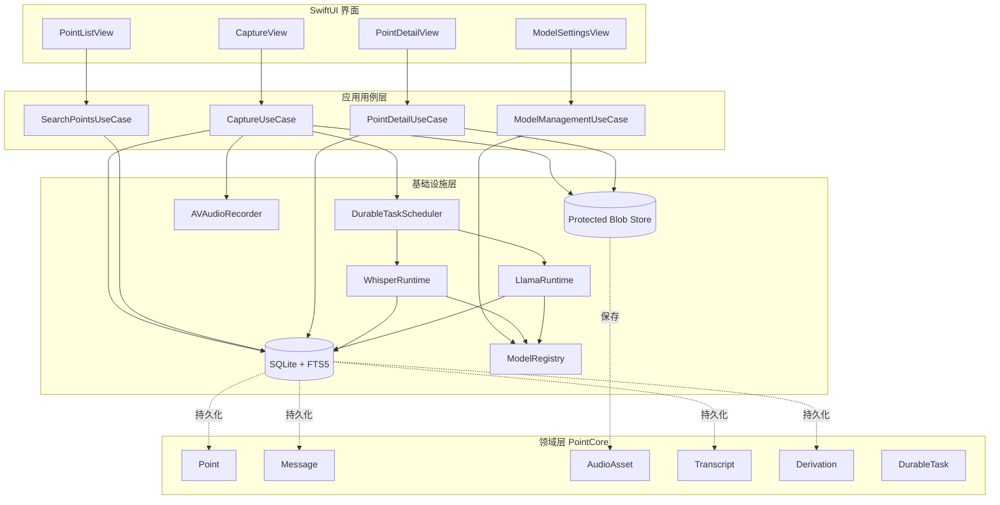
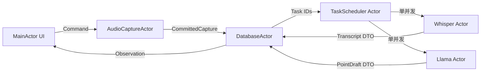
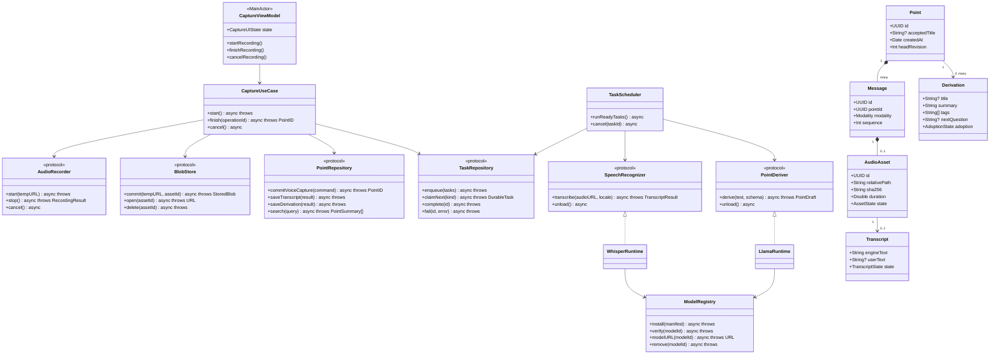
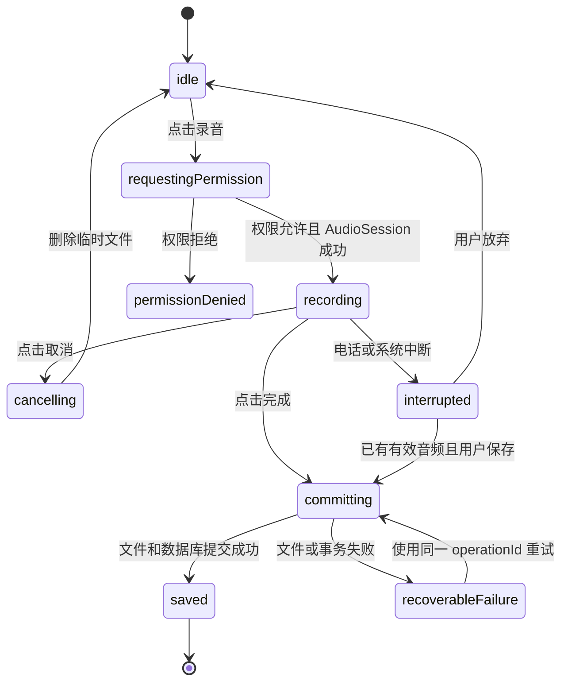
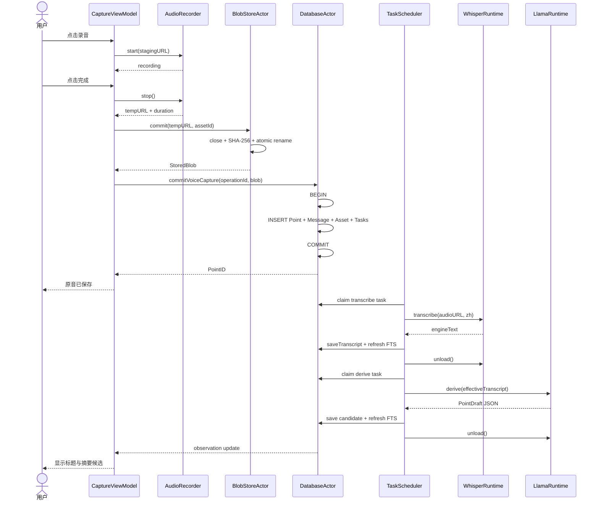
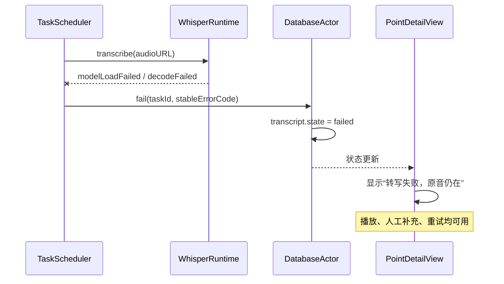
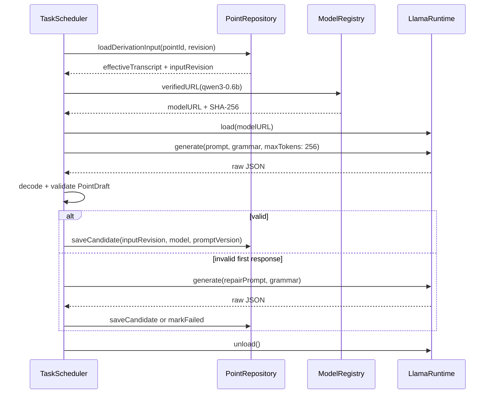
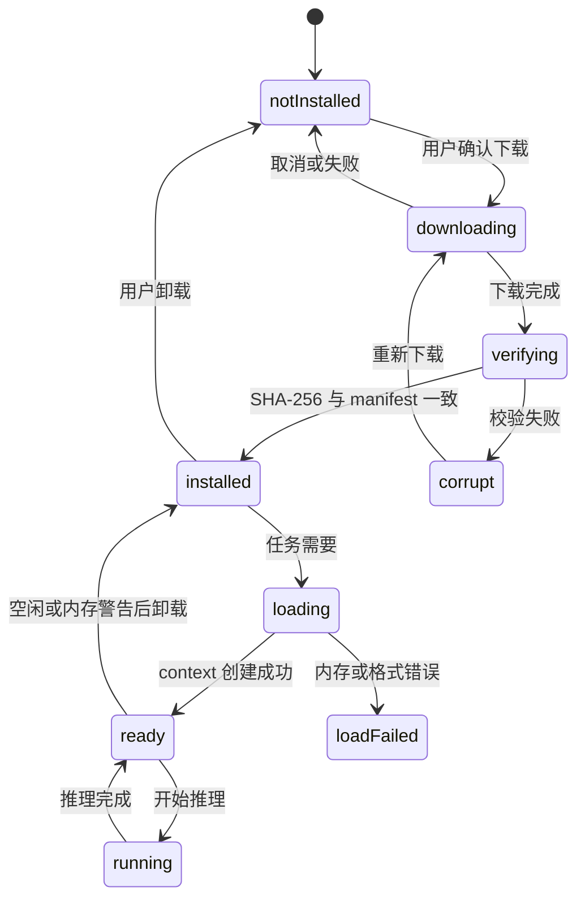
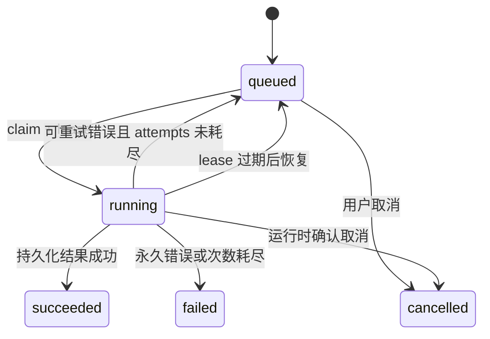

# 点界 PointVerse 核心语音 POC 技术方案

> 版本：v0.9 POC 0.1  
> 日期：2026-09-11  
> 平台：iPhone  
> 语言：Swift  
> 状态：可进入工程实现

## 0 决策摘要

这个 POC 只验证一件事：**用户能否用最低打断的方式留下语音想法，并在完全离线的情况下把它变成可找回、可继续的 Point。**

POC 只解决三个核心痛点：

1. **想法来得快，输入来不及**：一键录音，不要求标题、分类或完整表达。
2. **记录之后无法找回当时在说什么**：原音永久保留，本地转写可搜索、可人工修正。
3. **记录很多但无法继续思考**：本地小模型只生成标题、摘要、标签和下一问候选；用户确认后才写入正式字段。

技术主链：

```text
SwiftUI → AVFAudio → 原音原子落盘 → SQLite 事务成 Point
                                  ↓
                           whisper.cpp 本地转写
                                  ↓
                         llama.cpp 本地结构化整理
                                  ↓
                         FTS5 搜索与继续对话
```

POC 明确不做 Apple Watch、3D 点图、向量检索、关系推荐、远端模型、账号、同步、分享和 Agent。它们都不是验证上述核心价值的必要条件。

## 1 从第一性原理定义 POC

### 1.1 用户真正需要保存的是什么

用户需要保存的不是“转写文本”，而是**当时的表达证据**。语音原件是证据，转写只是它的一种可重建解释。

因此数据优先级为：

```text
原音 > 用户修正文本 > 机器转写 > 本地模型摘要 > 标签与索引
```

### 1.2 最短价值链

一次语音记录只有满足以下条件才算成功：

1. 音频文件已经完整关闭并原子落盘。
2. 数据库已经保存 Capture、Message 和 Point 的对应关系。
3. App 重启后仍能播放该原音。

“转写完成”“摘要完成”和“模型已加载”都不是保存成功的前提。

### 1.3 POC 的系统不变量

- 原音一旦进入 `available`，任何派生任务都不能覆盖或修改它。
- UI 只有在文件与数据库事务均成功后才显示“已保存”。
- 相同 `operationId` 重试不会创建第二个 Point。
- ASR 或 LLM 失败时，Point 仍可播放、编辑和再次处理。
- 本地模型只能读取调用方显式传入的内容，不能自行读取整个数据库。
- 模型输出先进入候选字段，不能覆盖用户修正文本。
- POC 运行期间不发出任何包含用户内容的网络请求。

## 2 POC 边界

### 2.1 必须完成

| 能力 | 最小行为 | 成功标准 |
| --- | --- | --- |
| 快速录音 | 首页一个主按钮，开始、结束、取消 | 两次点击内完成一条记录 |
| 可靠保存 | 原音先落盘，再事务成 Point | 杀进程后仍能看到并播放 |
| 本地转写 | 保存后异步转写普通话或中英混合语音 | 断网可运行；失败不影响原音 |
| 转写修正 | 显示机器文本，用户可编辑保存 | 修正版和机器原文分别保存 |
| 本地整理 | 生成标题、摘要、标签、下一问 | 严格 JSON；失败可重试 |
| 搜索 | 搜索用户修正版、机器转写、标题和摘要 | 1000 个 Point 下 P95 小于 500ms |
| 继续补充 | 在 Point 详情追加文字消息 | 追加到同一个 Point 修订链 |
| 模型管理 | 首次安装、校验、加载、卸载 | 无模型时仍可录音与搜索 |

### 2.2 明确不做

- Apple Watch 捕获和跨端同步。
- 3D 点图及空间布局。
- embedding、语义召回和关系分类。
- 云端 ASR、云端 LLM 或远端 Play。
- 图片、视频和文件附件。
- 账号、CloudKit、分享和协作。
- Action、Observation、Feedback 和 Branch。
- 自动后台持续监听。

### 2.3 POC 验证假设

| 假设 | 证据 |
| --- | --- |
| 语音比文字更少打断思路 | 同一用户分别完成语音和文字捕获，比较开始到保存耗时与主观打断程度 |
| 原音能弥补转写错误 | 用户能从详情播放原音并修正至少一个错误片段 |
| 本地整理帮助再次进入思路 | 隔日仅看标题与摘要，用户能说出当时意图并追加一条新想法 |
| 离线是可信体验的一部分 | 飞行模式完成录音、转写、整理、搜索和播放 |

## 3 技术选型

### 3.1 最小技术栈

| 层 | 选择 | 理由 |
| --- | --- | --- |
| UI | SwiftUI | 单一 iPhone Target，状态驱动，便于快速验证 |
| 并发 | Swift Concurrency | actor 隔离数据库、录音和模型运行时 |
| 录音 | AVFAudio | 系统框架；控制音频会话、文件格式和中断 |
| 数据库 | SQLite + GRDB | 显式事务、迁移、唯一约束、WAL 和 FTS5 |
| 文件 | FileManager + Data Protection | 原音、临时 PCM 和模型权重的生命周期管理 |
| ASR | whisper.cpp | 可离线运行，支持 iOS、Metal、Core ML 和量化 |
| 本地 LLM | llama.cpp | GGUF 模型、Metal、流式生成；与 whisper.cpp 同属 ggml 生态 |
| 小模型 | Qwen3-0.6B-GGUF Q8_0 | 中文和多语言能力；0.6B；官方 GGUF；Apache-2.0；约 639MB |
| ASR 模型 | Whisper `base` multilingual | 初始下载约 142MB；质量不足时再比较 `small`，不默认放大包体 |
| 日志 | OSLog | 隐私标记和本地诊断，不记录用户内容 |
| 测试 | XCTest + XCUITest | 领域、数据库、模型契约和主流程自动化 |

### 3.2 开源依赖

| 依赖 | 用途 | 接入方式 | 许可证 | POC 策略 |
| --- | --- | --- | --- | --- |
| [GRDB.swift](https://github.com/groue/GRDB.swift) | SQLite、迁移、事务、FTS5 | Swift Package Manager | MIT | POC 候选锁定 `7.10.0`，升级需重新跑数据库测试 |
| [whisper.cpp](https://github.com/ggml-org/whisper.cpp) | 本地语音识别 | 自建并固定 XCFramework | MIT | 固定 commit、构建参数和二进制 SHA-256 |
| [llama.cpp](https://github.com/ggml-org/llama.cpp) | 本地 GGUF 推理 | 自建并固定 XCFramework | MIT | 独立 Package 封装；link map 必须验证与 whisper.cpp 的 ggml 符号隔离 |
| [Qwen3-0.6B-GGUF](https://huggingface.co/Qwen/Qwen3-0.6B-GGUF) | 中文结构化整理 | 首次运行按需下载 | Apache-2.0 | 固定文件名、revision、大小和 SHA-256 |
| [whisper.cpp models](https://huggingface.co/ggerganov/whisper.cpp) | Whisper GGML 权重 | 首次运行按需下载 | 模型仓库标注 MIT | 固定模型 SHA-256；发布前复核模型许可与 NOTICE |

POC 不引入依赖注入、状态管理、网络、图片缓存或 JSON 包装库。Swift 协议、`Codable`、`URLSession`、`AsyncStream` 已足够。

`whisper.cpp` 和 `llama.cpp` 都包含 ggml 组件，不能假设拆成两个 Swift Package 就一定没有链接符号冲突。T0 必须检查最终 link map；优先生成符号隔离的动态 XCFramework。若工具链无法稳定隔离，则对其中一份 ggml 做可复现的符号前缀构建，或更换 LLM 运行时。未经验证不得把两个默认静态产物直接链接进 App。

### 3.3 为什么不使用两套本地模型框架

MLX Swift 也是可行候选，但 POC 同时引入 MLX 和 ggml 会增加模型格式、内存策略、构建链和调试面的数量。由于 ASR 已选择 whisper.cpp，LLM 先使用 llama.cpp，共享 Metal/Accelerate 方向和 GGUF 交付方式。

如果 llama.cpp 在目标设备上的首 token 延迟、峰值内存或稳定性未过门槛，再把 MLX Swift 作为替换实验，而不是首版并行实现。

## 4 总体架构图



### 4.1 运行时边界



约束：Whisper 与 Llama 不同时常驻内存。`TaskScheduler` 在进入 LLM 前释放 Whisper context；收到内存警告或 App 进入后台时卸载模型。

## 5 模块与目录

```text
PointVersePOC
├── App
│   ├── PointVerseApp.swift
│   └── AppContainer.swift
├── Features
│   ├── Capture
│   ├── PointList
│   ├── PointDetail
│   └── ModelSettings
├── Domain
│   ├── Models
│   ├── Repositories
│   ├── UseCases
│   └── Errors
├── Infrastructure
│   ├── Database
│   ├── Audio
│   ├── Tasks
│   ├── Whisper
│   ├── Llama
│   ├── Models
│   └── Diagnostics
├── Vendor
│   ├── WhisperRuntime
│   └── LlamaRuntime
└── Tests
    ├── DomainTests
    ├── DatabaseTests
    ├── ModelContractTests
    └── UITests
```

POC 使用一个 iOS App Target。`Vendor/WhisperRuntime` 和 `Vendor/LlamaRuntime` 是两个独立本地 Swift Package，只暴露 Swift 协议，不让业务代码接触 C API；底层二进制仍须通过 link map 验证 ggml 符号隔离。

## 6 类图



## 7 核心数据设计

### 7.1 SQLite Schema

```sql
PRAGMA foreign_keys = ON;
PRAGMA journal_mode = WAL;

CREATE TABLE points (
    id TEXT PRIMARY KEY NOT NULL,
    accepted_title TEXT,
    status TEXT NOT NULL DEFAULT 'active',
    head_revision INTEGER NOT NULL DEFAULT 1,
    created_at REAL NOT NULL,
    updated_at REAL NOT NULL
);

CREATE TABLE messages (
    id TEXT PRIMARY KEY NOT NULL,
    operation_id TEXT NOT NULL UNIQUE,
    point_id TEXT NOT NULL REFERENCES points(id) ON DELETE CASCADE,
    sequence INTEGER NOT NULL,
    role TEXT NOT NULL CHECK (role IN ('user', 'assistant')),
    modality TEXT NOT NULL CHECK (modality IN ('voice', 'text')),
    user_text TEXT,
    created_at REAL NOT NULL,
    UNIQUE(point_id, sequence)
);

CREATE TABLE audio_assets (
    id TEXT PRIMARY KEY NOT NULL,
    message_id TEXT NOT NULL UNIQUE REFERENCES messages(id) ON DELETE CASCADE,
    relative_path TEXT NOT NULL UNIQUE,
    sha256 TEXT NOT NULL,
    byte_count INTEGER NOT NULL,
    duration_ms INTEGER NOT NULL,
    codec TEXT NOT NULL,
    sample_rate INTEGER NOT NULL,
    state TEXT NOT NULL CHECK (state IN ('committing', 'available', 'quarantined')),
    created_at REAL NOT NULL
);

CREATE TABLE transcripts (
    id TEXT PRIMARY KEY NOT NULL,
    asset_id TEXT NOT NULL UNIQUE REFERENCES audio_assets(id) ON DELETE CASCADE,
    engine_text TEXT,
    user_text TEXT,
    locale TEXT NOT NULL,
    model_id TEXT NOT NULL,
    model_sha256 TEXT NOT NULL,
    state TEXT NOT NULL CHECK (state IN ('queued', 'running', 'succeeded', 'failed')),
    error_code TEXT,
    created_at REAL NOT NULL,
    updated_at REAL NOT NULL
);

CREATE TABLE derivations (
    id TEXT PRIMARY KEY NOT NULL,
    point_id TEXT NOT NULL REFERENCES points(id) ON DELETE CASCADE,
    input_revision INTEGER NOT NULL,
    model_id TEXT NOT NULL,
    model_sha256 TEXT NOT NULL,
    prompt_version TEXT NOT NULL,
    title TEXT,
    summary TEXT,
    tags_json TEXT,
    next_question TEXT,
    raw_json TEXT,
    state TEXT NOT NULL CHECK (state IN ('queued', 'running', 'succeeded', 'failed')),
    adoption TEXT NOT NULL DEFAULT 'candidate',
    error_code TEXT,
    created_at REAL NOT NULL
);

CREATE TABLE durable_tasks (
    id TEXT PRIMARY KEY NOT NULL,
    operation_id TEXT NOT NULL UNIQUE,
    kind TEXT NOT NULL CHECK (kind IN ('transcribe', 'derive')),
    payload_json TEXT NOT NULL,
    state TEXT NOT NULL CHECK (state IN ('queued', 'running', 'succeeded', 'failed', 'cancelled')),
    attempt_count INTEGER NOT NULL DEFAULT 0,
    next_run_at REAL NOT NULL,
    lease_until REAL,
    last_error_code TEXT,
    created_at REAL NOT NULL,
    updated_at REAL NOT NULL
);

CREATE VIRTUAL TABLE point_search USING fts5(
    point_id UNINDEXED,
    accepted_title,
    transcript_text,
    summary,
    tags,
    tokenize = 'unicode61'
);
```

### 7.2 文件目录

```text
Application Support/PointVerse
├── pointverse.sqlite
├── pointverse.sqlite-wal
├── pointverse.sqlite-shm
├── blobs
│   └── audio
│       └── {assetId}.m4a
├── models
│   ├── whisper-base.bin
│   └── qwen3-0.6b-q8_0.gguf
└── staging
    └── {operationId}.m4a.tmp
```

- `staging` 和 `blobs` 必须位于同一文件系统，以保证 rename 的原子性。
- 数据库、WAL、SHM、音频和模型均排除普通 iCloud 文档同步。
- 音频与数据库设置一致的数据保护等级。
- 模型文件不进入用户备份；可从 manifest 重新下载。
- App 启动时扫描超过阈值的 staging 文件：能校验则恢复提交，否则标记并提示，不静默删除。

## 8 语音链路

### 8.1 录音格式

原件使用 M4A/AAC，单声道。POC 从以下参数开始真机测试：

```swift
let settings: [String: Any] = [
    AVFormatIDKey: kAudioFormatMPEG4AAC,
    AVSampleRateKey: 24_000,
    AVNumberOfChannelsKey: 1,
    AVEncoderAudioQualityKey: AVAudioQuality.high.rawValue
]
```

这些参数是 POC 起点，不是最终音质结论。保存原件时不为了 Whisper 改写原文件；转写前通过 `AVAudioConverter` 解码为 16kHz、单声道、Float32 PCM。

### 8.2 录音状态机



### 8.3 语音保存与派生序列图



### 8.4 转写失败序列图



### 8.5 WhisperRuntime 接口

```swift
struct TranscriptResult: Sendable, Equatable {
    let text: String
    let detectedLanguage: String?
    let duration: Duration
    let modelID: String
    let modelSHA256: String
}

protocol SpeechRecognizer: Sendable {
    func transcribe(
        audioURL: URL,
        localeHint: Locale?
    ) async throws -> TranscriptResult

    func unload() async
}
```

运行约束：

- `WhisperRuntime` 是 actor，同一时刻只运行一个转写。
- 每次调用前验证模型 manifest 和文件 SHA-256。
- 音频解码失败、模型损坏、内存不足和用户取消映射为稳定错误码。
- 第一轮只使用最终转写，不实现实时流式字幕。
- `engineText` 原样保存；用户编辑写入 `userText`。
- 后续整理的有效文本为 `userText ?? engineText`。

## 9 本地模型链路

### 9.1 本地模型只做窄任务

POC 不让 LLM 自由聊天。它只把转写转换为以下结构：

```json
{
  "title": "上下文本身也是一个点",
  "summary": "用户在思考上下文是否应作为可保存和连接的独立对象。",
  "tags": ["上下文", "知识组织"],
  "nextQuestion": "哪些上下文值得作为独立 Point 保存？"
}
```

限制：

- 标题最多 20 个中文字符。
- 摘要最多 80 个中文字符。
- 标签 0–3 个，每个最多 10 个字符。
- 下一问最多 40 个中文字符，可以为空。
- 不输出事实判断、心理诊断、行动执行或关系类型。
- 输出不是用户原意，只显示为“本地模型候选”。

### 9.2 Prompt 契约

```text
system:
你是本地运行的 Point 整理器。只根据 INPUT 生成 JSON。
不得补充 INPUT 中没有的事实，不得诊断用户，不得输出 JSON 之外的文字。
字段必须是 title、summary、tags、nextQuestion。

user:
INPUT_VERSION: 1
LANGUAGE: zh-CN
INPUT:
{{effectiveTranscript}}
```

POC 使用 llama.cpp grammar 或 JSON schema 约束输出。解析仍需失败保护：去除首尾空白后只接受单一 JSON 对象，并校验长度、字段和数组数量。解析失败最多使用同一输入重试一次；第二次失败将任务标记为失败。

### 9.3 LLM 序列图



### 9.4 LlamaRuntime 接口

```swift
struct PointDraft: Codable, Sendable, Equatable {
    let title: String?
    let summary: String
    let tags: [String]
    let nextQuestion: String?
}

struct GenerationRequest: Sendable {
    let prompt: String
    let grammar: String
    let maxTokens: Int
    let temperature: Float
    let seed: UInt64
}

protocol PointDeriver: Sendable {
    func derive(
        transcript: String,
        inputRevision: Int
    ) async throws -> PointDraft

    func unload() async
}
```

建议从 `temperature = 0.2`、固定 seed、`maxTokens = 256` 开始，降低 POC 输出波动。每条结果保存模型 ID、模型 SHA-256、prompt version 和输入修订号。

### 9.5 模型生命周期



### 9.6 模型下载与供应链

模型 manifest 必须随 App 版本发布：

```json
{
  "id": "qwen3-0.6b-q8_0",
  "revision": "pinned-repository-revision",
  "filename": "Qwen3-0.6B-Q8_0.gguf",
  "byteCount": 639000000,
  "sha256": "release-time-value",
  "license": "Apache-2.0",
  "minimumFreeDiskBytes": 1300000000
}
```

规则：

- 文档中的大小用于容量预估；实际交付以锁定 revision 后的文件和 SHA-256 为准。
- 下载到 `.partial`，完成后校验，再原子 rename。
- 下载失败不影响录音、播放、人工修正和 FTS 搜索。
- POC 不自动更新模型；升级模型需要新 manifest 和回归样本。
- App 内提供许可证和模型来源页面。

## 10 DurableTask 调度



调度规则：

1. `transcribe` 优先于 `derive`。
2. 同一 Point 的 `derive` 必须等待 `transcribe.succeeded` 或用户已提供文本。
3. 同一时刻只允许一个模型任务。
4. 默认最多重试 2 次，退避 2 秒和 10 秒。
5. 模型未安装、低电量或内存不足不算一次失败，任务停留 queued 并展示原因。
6. 每次 claim 设置 lease；App 崩溃后过期任务回到 queued。
7. 输入修订变化时，旧 derive 结果仍保留但标记 stale，不自动覆盖新修订。

## 11 核心 UI

POC 只有四个页面：

| 页面 | 必须显示 | 主要操作 |
| --- | --- | --- |
| 捕获页 | 录音按钮、时长、取消、完成、保存事实 | 录音并保存 |
| Point 列表 | 标题回退、时间、语音标识、转写或整理状态 | 搜索、打开、重新处理 |
| Point 详情 | 原音播放器、机器转写、用户修正、候选摘要 | 播放、修正、接受标题、继续补充 |
| 模型设置 | ASR/LLM 模型状态、大小、校验、卸载 | 下载、暂停、重试、删除 |

标题回退顺序：

```text
用户接受的标题 → 本地模型候选标题 → 用户文字前 20 字 → 日期与时间
```

状态文案使用事实：

- `原音已保存`
- `等待本地转写`
- `本地转写中`
- `转写失败，原音仍在`
- `等待本地整理`
- `本地模型未安装`
- `摘要为模型候选`

## 12 错误模型

```swift
enum PointVerseErrorCode: String, Codable, Sendable {
    case microphonePermissionDenied
    case audioSessionUnavailable
    case recordingInterrupted
    case audioCommitFailed
    case databaseCommitFailed
    case insufficientDiskSpace
    case modelNotInstalled
    case modelChecksumMismatch
    case modelLoadFailed
    case audioDecodeFailed
    case transcriptionFailed
    case generationFailed
    case invalidModelOutput
    case cancelled
}
```

错误对象可保存 code、阶段、时间、attempt 和无敏感信息的 detail。不得保存原始文本、转写、绝对文件路径或 prompt。

## 13 测试计划

### 13.1 单元与集成测试

| 测试组 | 必测用例 |
| --- | --- |
| Capture | 权限拒绝、取消、系统中断、零长度、磁盘不足、重复完成 |
| BlobStore | SHA-256、原子 rename、临时文件恢复、删除、保护属性 |
| Database | 首次成点、同 operationId 幂等、WAL 恢复、迁移、级联删除 |
| TaskScheduler | claim、lease 过期、取消、重试上限、依赖顺序、旧修订 stale |
| Whisper | 中文、英文、中英混合、静音、噪声、损坏文件、模型损坏 |
| Llama | 合法 JSON、额外文本、缺字段、超长字段、取消、确定性 |
| Search | 中文关键词、用户修正版优先、摘要、空查询、1000 Point 性能 |
| Privacy | 飞行模式主流程、网络请求拦截、日志内容扫描 |

### 13.2 固定评测集

在仓库中建立不含真实私人内容的测试夹具：

```text
Fixtures
├── audio
│   ├── zh_clean_10s.m4a
│   ├── zh_en_mixed_20s.m4a
│   ├── zh_noise_30s.m4a
│   ├── silence_10s.m4a
│   └── corrupt.m4a
├── expected_transcripts.json
├── derivation_cases.json
└── search_seed_1000.json
```

ASR 不以单一“看起来不错”的演示验收。至少记录：

- 字错误率 CER。
- 实时时间因子 RTF，即处理耗时除以音频时长。
- 模型首次加载时间。
- 峰值内存。
- 设备、系统、温度状态和低电量模式。

LLM 至少记录：

- JSON 一次解析成功率。
- 字段约束通过率。
- 首 token 延迟和总耗时。
- 峰值内存。
- 事实添加率，由人工判断输出是否引入输入中不存在的信息。
- 用户接受标题或摘要的比例。

### 13.3 POC 验收门

| 类别 | 阻断条件 |
| --- | --- |
| 数据 | 任一已显示“原音已保存”的记录在重启后丢失或不可播放 |
| 幂等 | 同一 `operationId` 产生多个 Point 或 Message |
| 隐私 | 飞行模式外，发现任何未明确说明的内容外发 |
| 派生隔离 | ASR/LLM 失败导致 Point、原音或用户修正被删除或覆盖 |
| 搜索 | 1000 Point 关键词搜索 P95 超过 500ms |
| 保存 | 基准设备本地元数据提交 P95 超过 300ms，不含录音时长和模型耗时 |
| 模型输出 | 无法稳定产出合法结构，或候选被误当成用户原话 |

模型性能不设脱离设备的绝对承诺。T0 必须先选定至少一台最低基准设备和一台主力设备，记录实测后冻结门槛。

## 14 实施顺序

### P0 骨架与可靠保存

- 建立单 Target SwiftUI 工程和模块目录。
- 接入 GRDB，创建 v1 migration。
- 实现 `AudioRecorder`、`BlobStoreActor` 和 `CaptureUseCase`。
- 完成录音、原子落盘、事务成点、重启播放和幂等测试。

退出条件：不接模型也能稳定完成“录音 → 保存 → 重启 → 播放”。

### P1 本地转写

- 固定 whisper.cpp commit，生成 XCFramework 并记录构建命令与 SHA-256。
- 实现 16kHz Float32 转换和 `WhisperRuntime` actor。
- 接入模型安装、校验、卸载。
- 实现 `DurableTask` 的 claim、lease、重试和恢复。
- 完成机器转写、用户修正和 FTS 索引。

退出条件：飞行模式下完成保存、转写、修正和搜索；失败不影响原音。

### P2 本地整理

- 固定 llama.cpp commit 和 Qwen3-0.6B GGUF revision。
- 实现 grammar/JSON schema 输出约束。
- 保存模型、prompt、输入修订和候选状态。
- 实现候选标题、摘要、标签和下一问的接受或忽略。
- 完成模型串行调度、卸载和内存警告处理。

退出条件：固定评测集 JSON 一次解析成功率达到预定门槛，候选不会覆盖用户内容。

### P3 用户 POC

- 加入 1000 Point 性能夹具和隐私网络审计。
- 完成错误文案和模型设置页。
- 邀请 5 位个人思考者完成即时捕获、隔日找回、修正与继续补充。
- 根据证据决定下一步是 Watch 捕获、3D 空间，还是先改善语音与模型质量。

## 15 Definition of Done

POC 完成必须同时满足：

- 用户可以在两次点击内完成一条语音 Point。
- UI 的“已保存”对应文件和数据库的真实持久化事实。
- App 被杀死后，所有已保存原音仍能恢复和播放。
- 飞行模式下可完成本地转写、本地整理和关键词搜索。
- 用户可以修正转写，机器文本与用户文本均可追溯。
- 本地模型只生成候选，不覆盖原音、转写或用户文字。
- 模型未安装、损坏、加载失败、输出错误或内存不足时，基本记录流程仍可用。
- 1000 Point 保存和搜索达到产品文档中的目标，实测设备与数据可复现。
- 依赖、模型、许可证、revision、构建参数和 SHA-256 均有清单。
- 5 人原型测试至少 4 人能无指导完成录音、找回、播放和继续补充。

## 16 后续决策门

POC 通过后，不自动进入全部 v0.9 范围，而按证据选择一个方向：

| 观察结果 | 下一步 |
| --- | --- |
| 手机录音价值成立，但入口仍慢 | 做 Apple Watch 主动短语音试点 |
| 记录很多但仍难找回 | 先验证 embedding 和关系候选，再考虑 3D |
| 摘要帮助不大 | 缩减 LLM，强化人工修正、时间流和关键词搜索 |
| 本地模型成本过高 | 保留本地 ASR，重新评估更小模型或系统能力 |
| 用户能找回但不能继续 | 增加 Play 或“下一问”，仍不自动执行行动 |

## 17 参考资料

### 项目内文档

- [产品文档 v0.9](./PointVerse-点界-产品文档-v0.9.docx)
- [Swift 技术方案](./PointVerse-点界-技术方案-v0.9-Swift.md)
- [最新交互原型](./interact.html)

### 开源项目与模型

- [whisper.cpp](https://github.com/ggml-org/whisper.cpp)
- [whisper.cpp SwiftUI iOS 示例](https://github.com/ggml-org/whisper.cpp/tree/master/examples/whisper.swiftui)
- [llama.cpp](https://github.com/ggml-org/llama.cpp)
- [GRDB.swift](https://github.com/groue/GRDB.swift)
- [MLX Swift 备选](https://github.com/ml-explore/mlx-swift)
- [Qwen3-0.6B-GGUF](https://huggingface.co/Qwen/Qwen3-0.6B-GGUF)
- [whisper.cpp 模型仓库](https://huggingface.co/ggerganov/whisper.cpp)

### Apple 平台资料

- [AVFAudio](https://developer.apple.com/documentation/avfaudio)
- [Protecting the user’s privacy](https://developer.apple.com/documentation/uikit/protecting-the-user-s-privacy)
- [Reducing your app’s memory use](https://developer.apple.com/documentation/xcode/reducing-your-app-s-memory-use)

所有开源依赖和模型在发布前都必须重新核对许可证、NOTICE、商用限制、目标平台支持和锁定 revision。本文不是法律意见。
