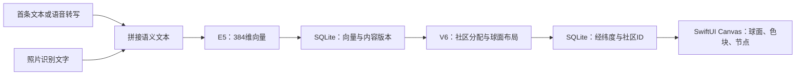
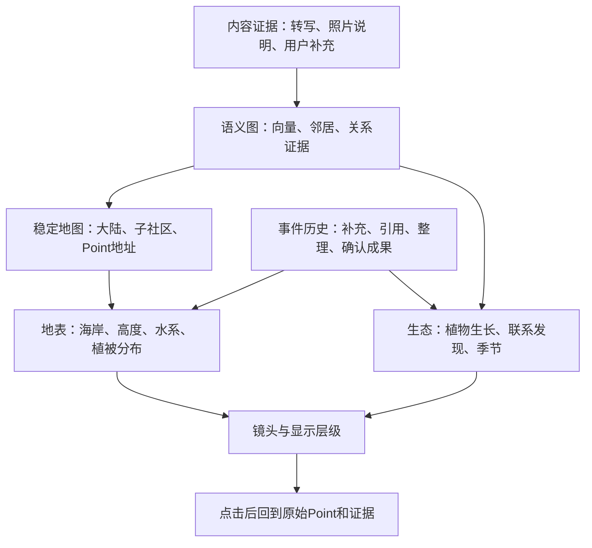

# PointVerse：从语义坐标到会生长的星球

> 版本：v0.1 · 2026-10-04  
> 状态：设计提案，包含现有代码分析、产品构想与分阶段技术路线；本文不代表相关能力已经实现。  
> 分析基线：提交 `29894eb` 及当前工作区。重点覆盖 E5、语义坐标引擎、地球绘制和数据库；未使用用户的真实 Point 数据做效果评测。

## 1. 我们最终想做出什么

点界可以成为一颗由个人经历、问题、知识和创作共同塑造的星球。

第一次记录时，海面上出现一座小岛。你开始围绕一个问题持续思考，小岛长出山坡，坡上有草木。几个月后，熟悉的主题形成大陆，反复推敲的思想形成山脉，彼此关联的记录成为林地。新的联想跨越原来的领域，像鸟群穿过海峡，将两片森林联系起来。

你记得某条想法“在那座山的东侧、河湾附近”。再次打开时，它仍在那里。点开一棵树，可以听见当时的原音，看到后来补充的照片，以及这条想法如何发展。

这个世界首先要帮助人找回、理解和发展自己的想法。自然景观承担清晰的信息含义，允许美术上的变化，也保留对每个含义的解释入口。

核心建议是：**以稳定的语义地图为地基，以真实的内容与事件驱动生态，让视觉细节逐层生长。**

## 2. 当前代码实际做了什么

### 2.1 已有的数据链路



当前输入已经主要由内容驱动，不是按“录音、照片、文字”这种媒介类型分类。E5 推理采用 `query:` 前缀、masked mean pooling 和 L2 归一化，默认仅保留前 128 个 token，配置为 CPU 推理。

数据库已有 `contentRevision`、`modelID`、`geographyVersion`、`communityID`、经纬度、`altitude` 和 `isPinned`。这提供了很好的演进基础，但 `altitude` 目前默认是 0，地球绘制也没有使用真实高度场。

对应代码：[语义文本构造](../ios/PointVerseKit/Sources/PointVerseKit/Infrastructure/Database/PointDatabase.swift#L438)、[E5 推理](../ios/PointVerseApp/Features/Embedding/E5CoreMLEmbedding.swift#L24)、[坐标数据结构](../ios/PointVerseKit/Sources/PointVerseKit/Domain/Models.swift#L159)。

### 2.2 坐标并不是直接从语义向量映射出来的

当前 `SemanticGeographyEngine.make` 的过程是：

1. 按 Point UUID 排序，读取可复用的历史位置。
2. 对 E5 向量归一化，并减去当前资料库的平均向量，再归一化。
3. 用最远点选种子，最多分出 12 个社区。
4. 按社区序号，把中心放到 Fibonacci 球面格点。
5. 新点从社区中心附近的确定性位置开始，或靠近相似的历史点。
6. 做 120 轮社区内吸引与排斥，未复用历史坐标的新点被限制在中心周围 0.22 弧度内。
7. 已有且可复用的点保持位置不变。

因此，现在的地球可以表达一部分“同组关系”，但不同大陆之间的距离并不充分表达主题关系：软件工程与产品设计是否靠近，很大程度上取决于社区序号与固定格点。

对应代码：[当前坐标引擎](../ios/PointVerseKit/Sources/PointVerseKit/Domain/SemanticGeographyEngine.swift#L3)。

### 2.3 长期发展前需要处理的限制

| 代码现状 | 对体验和扩展的影响 | 建议方向 |
| --- | --- | --- |
| 当前资料库整体去均值 | 新增内容会改变其他点的比较基准；小样本尤其不稳定 | 保留原始归一化向量，局部排名校准；需要中心化时固定并版本化参考变换 |
| 最多 12 个社区，单一归属 | 大主题越积越拥挤，跨领域内容难表达 | 持久化的多层社区，允许主归属与辅助归属 |
| 中心按 Fibonacci 格点分配 | 跨社区语义关系没有真正进入大陆位置 | 格点只作初始条件，再依据社区关系优化 |
| 新点限制在 0.22 弧度区域 | 每个社区容量固定，记录增加后容易重叠 | 地块面积与细分层级共同扩展，采用多尺度展示 |
| 旧位置冻结，但社区种子重新计算 | 坐标稳定不等于社区身份稳定；新旧归属可能脱节 | 持久社区身份、原型与分裂合并历史 |
| 仅取首条消息与图片文字，随后截断到 128 token | 长录音后半段、后续对话和不同照片的信息可能没有参与定位 | 分块、多来源证据、用户后续补充纳入语义契约 |
| 大陆由 6° 网格按最近社区中心着色 | 海岸粗糙，缺少山势、水系和真实地表层次 | 连续地形场与分块、多精度网格 |
| 放大到 1.75 倍即展开所有可见点 | 点、标题仍会在密集区域重叠 | 根据屏幕空间和信息层级展开，而非固定倍率一次展开 |
| 省、市、区按方位角桶划分 | 更像几何分区，没有真正的多层语义结构 | 大陆、流域、林地来自真实层级社区 |
| 南北极标注“抽象／具体” | 代码没有计算这个语义轴，标签会误导 | 暂作普通地理方位，特定语义维度作为独立图层 |

0.22 弧度约等于 12.6°。对应球冠面积约为整球的 1.2%；即使有 12 个互不重叠的这样的球冠，总面积也只有约 14.5%。这是当前新点放置区域的几何限制，不是实际所有历史点面积的测量结果。单纯继续提高最大放大倍数，只能缓解局部查看。

一个可直接从公式推导的边界问题是：仅有两条不同向量 `v1`、`v2` 时，去均值后的残差为：

```text
μ = (v1 + v2) / 2
r1 = (v1 - v2) / 2
r2 = -r1
```

只要残差超过当前代码的微小值回退阈值，归一化后两者余弦就是 -1，即使原始内容非常接近。冷启动阶段尤其需要避免使用这种即时资料库中心化。

绘制细节见：[大陆网格](../ios/PointVerseApp/Features/StarMap/GlobeMapView.swift#L659)、[显示聚合](../ios/PointVerseApp/Features/StarMap/GlobeMapView.swift#L845)、[极点标签](../ios/PointVerseApp/Features/StarMap/GlobeMapView.swift#L769)、[行政分区](../ios/PointVerseApp/Features/StarMap/GlobeMapView.swift#L575)。

### 2.4 还有一笔可以避免的计算

地球读取数据后，先运行 `SemanticGeographyEngine`，随后又调用 `StarLayoutEngine.make`。后者创建 N×N 相似度矩阵，执行另一套 120 轮全对布局；但地球节点位置最终使用的是持久化经纬度，也不绘制这套候选虚线。

每保存一个 embedding，当前服务又会发通知触发地球重新读取，批量回填时会重复发生上述计算。星图和地球还使用不同的布局和阈值，同一份内容可能呈现不同关系。

应让它们共享语义图、社区与快照，分别负责呈现。地球直接消费坐标快照；星图按需要渲染关系视图。将布局计算移到独立任务，批量合并通知。

对应代码：[地球装载](../ios/PointVerseApp/Features/StarMap/GlobeMapView.swift#L96)、[星图布局](../ios/PointVerseApp/Features/StarMap/StarMapView.swift#L436)、[逐条回填通知](../ios/PointVerseApp/Features/Embedding/EmbeddingService.swift#L15)。

### 2.5 Demo 与真实数据要分开验收

球面分布 Demo 从 JSON 直接读取经纬度和社区信息，绕过真实的语义定位。Demo 可以证明界面能画出分布，不能证明 E5 和布局算法能得到同样的分布。

已有测试验证确定性、旧点不移动以及简单分组，仍缺少真实多语言内容、增量社区身份、长文本、多主题和密集点可访问性测试。

对应代码：[Demo](../ios/PointVerseApp/Features/StarMap/GlobeMapView.swift#L1223)、[已有坐标测试](../ios/PointVerseKit/Tests/PointVerseKitTests/PointDatabaseTests.swift#L183)。

## 3. 自然景观的含义

建议先确定下面这份视觉词典，再选择具体画风。含义可以在验证后调整，但同一版本内应一致。

| 景观 | 表达什么 | 用户能做什么 |
| --- | --- | --- |
| 大陆 | 长期形成的主要内容领域 | 进入、命名、查看主题演变 |
| 岛屿与群岛 | 新出现或暂时独立的小主题 | 查看原始记录，探索可能相关的大陆 |
| 海洋 | 当前地图中尚未形成稳定记录聚落的空间 | 平静留白，为未来主题保留空间 |
| 山脉与高原 | 一个主题经长期补充、修订、交叉关联形成的积累 | 查看其代表记录、演变与用户确认的成果 |
| 山谷 | 同一大陆内部不同子主题的分界与过渡 | 沿谷浏览邻近主题 |
| 河流与流域 | 自然地表的水系；部分经验证的思考路径可被映射到它们 | 在有证据的河段上追溯来源、后续补充和成果 |
| 湖泊 | 被用户整理、收藏为一个整体的专题集合 | 打开专题及其包含的 Point |
| 草、树、花 | 单条想法及其生长状态 | 查看原音、照片、文本和对话 |
| 森林 | 多条有关联、仍保持独立身份的记录共同形成的局部群落 | 缩放进入，按子主题或时间浏览 |
| 果实 | 用户确认保留的结论、作品或行动结果 | 直接打开对应产物 |
| 鸟、蝶等动物 | 跨主题联系的探索入口及其有限动画表达 | 查看这次联想连接了哪些内容、依据是什么 |
| 天气与季节 | 近期活动、回顾与时间变化的可选视觉层 | 切换时间，回看过去某一阶段 |

这里的高山表示“累积”，不代表观点正确；森林繁密表示关系丰富，不代表内容更有价值。沙地、海洋和安静区域也应好看，让不同记录习惯都能得到舒适的世界。

应把三件事分开：内容谈什么，内容如何发展，地表采用什么美术风格。不能机械地让每条“工作”都是荒漠、每条“旅行”都是海岛，也不根据私人记录自动给用户贴人格标签。

## 4. 总体架构：五个可独立演进的层



内容与关系是事实来源；地图和生态是可重新生成的派生数据。坐标算法升级、换模型或换画风，都不能损坏原音、照片和用户文字。

各层分别版本化。修改树叶样式不重新算 embedding，切换语言不搬动大陆，旋转镜头不改变社区成员。

## 5. 语义基础：先把内容理解完整

### 5.1 建立明确的内容契约

一个 Point 的语义证据包括：用户修正文稿优先的原始文本、用户在后续对话中的实质补充、每张照片的识别说明，以及用户明确保留的 AI 整理结果。

自动生成的标题与助手整段回答默认不反复回灌，以免模型自己生成的内容逐渐主导星球。只有用户确认保留的整理结果，才作为额外来源参与。每段都记录来源、时间和内容版本。

录音长度、设备名、上传状态、界面语言不决定主题。多张照片分别保留来源，避免后面添加的照片被长文本截断掉。

### 5.2 从“一条向量”发展到“一个地址、多种视角”

第一阶段按语句与 token 上限切块，用当前 E5 串行编码，保存 chunk 向量，再产生 Point 代表向量。块数与总预算有上限，未覆盖完整内容时记录覆盖状态，不声称已理解全部。

长内容的调度需要兼顾开头、结尾、不同来源和新增部分。候选的 128-token 块、少量重叠以及每批块数只是待真机评测的参数，不作为模型固有限制。

后续允许一个 Point 有多个语义侧面。例如“用摄影记录植物生长”可以主属于园艺，辅助关联摄影。它有唯一的原始记录和主要地址，辅助归属通过入口与关系表达，不复制成两条真实记录，也不简单取两个遥远大陆的几何中点放进海里。

代表向量平均可能稀释多主题，不能作为唯一检索依据；邻居召回应逐步支持 chunk／侧面匹配。

### 5.3 模型职责

当前先使用 Hark E5。E5 负责语义邻近；已有本地语言模型可按需负责地区命名、专题摘要及关系候选解释。坐标、河道、树木数量和动画由可复现的规则计算。

命名优先使用代表内容、关键词和用户命名，生成式命名异步缓存。UI 切换中繁英日时只切换名字和说明，区域 ID、坐标、关系保持一致。

## 6. 新坐标算法：稳定地址与多尺度社区

建议将新方案命名为 `semantic-atlas-v7`，保留 V6 快照供比较和回退。下面是拟议算法，不是已完成的实现。

### 6.1 建立稀疏邻居图

对每条记录寻找少量语义邻居，例如先以 Top-20 作为实验起点。基于局部相对排名与校准后的相似度赋权，优先保留双向近邻，并结合用户确认的关联。

Top-K 本身不意味着相关：资料很少、邻居分数低或差异不明显时，允许没有边。弱关联和明确关系分开存储；余弦相似不自动解释为支持、因果或衍生。

最初可采用分块精确扫描。规模或耗时达到实测门槛后引入近似索引，例如 HNSW；它是可参考的近邻检索算法，不是当前已集成的依赖。[HNSW 原始论文](https://arxiv.org/abs/1603.09320)

保存 O(Nk) 的稀疏边，避免长期保留 N×N 相似度矩阵。必须注意：构建精确邻居图仍可能需要 O(N²d) 计算，稀疏存储并不会自动消除检索成本。

### 6.2 社区有稳定身份，也有层级

```text
星球
  大陆：长期领域
    地区／流域：持续问题或项目
      林地：紧密子主题
        Point：可追溯的原始记录
```

不要把大陆数量写死为 12。数量由关系结构和可读性共同决定，记录稀少时允许平坦结构，不能一条记录也强行生出四层行政机构。

第一版可从稀疏图做确定性的局部社区优化；保留足够稳定的数据后再比较更复杂算法。每个社区持久化独立 ID、原型、代表样本、父级和历史成员，不能把“这次选中的种子 Point ID”直接当永久身份。

新旧社区通过成员重叠、原型相近程度和父子关系匹配。分裂保留主体 ID 并生成子 ID，合并保留历史别名；命名与用户地标随身份延续。

### 6.3 大陆的位置也应考虑语义关系

首次建图时，少量社区中心可以从均匀球面分布开始，再按社区间关系进行球面布局。相关社区较近，独立社区保留海面间隔。面积、边界和中心都需要空间约束，避免大大陆吞没小主题。

球面只有两个位置自由度，无法无损保存 384 维关系。因此要优先保持重要邻居和可记忆的区域，而不是承诺所有语义距离都对应精确的地理距离。跨大陆但仍有关联的内容，通过联想入口表达。

已经发布给用户的世界以稳定为先。日常新增内容只在现有地理上插入；跨大陆调整留到可预览、可回退的地图整理操作。

### 6.4 新点局部插入，旧点有移动预算

新点先找已有的可信邻居与社区，在局部球面上求加权中心，再做有限范围的排斥和邻居距离优化。邻居分处相反方向、平均向量接近零时，使用主社区的局部坐标，不直接归一化一个退化向量。

没有合适邻居时建立独立的小岛或候选社区，不能强行塞进当前最大的大陆。岛屿位置可由固定种子和已占用空间决定，但这种布局选择不被解释为额外的语义知识。

一个示意目标函数如下：

```text
L = Σ(i,j ∈ 邻居边) wᵢⱼ · (球面距离(xᵢ,xⱼ) - 目标距离ᵢⱼ)²
  + λ · Σ(i ∈ 历史点) aᵢ · 球面距离(xᵢ,xᵢ_old)²
  + μ · 局部拥挤惩罚
  + ν · 社区边界软约束

约束：|xᵢ| = 1；用户固定点 xᵢ = xᵢ_old。
```

局部拥挤项通过空间索引寻找附近点，不能再次遍历所有点对。系数与目标距离需用样本评测，不直接沿用去均值前后的同一个 0.88 阈值。

日常插入默认保持旧点地址不动；必要的局部整理允许有限漂移，但用户固定点保持不变。对于大量近乎相同的记录，用同址聚合和逐层浏览处理，不为排开圆点而破坏语义关系。

可借鉴 UMAP 将新样本放入既有布局的思路，以及 AlignedUMAP 对相邻数据版本保持对应关系的思路。这里建议实现符合 Swift、球面和持久地址要求的布局器；不把这两种工具视为现成的 iOS 星球引擎。[UMAP 新数据变换](https://umap-learn.readthedocs.io/en/latest/transform.html)、[AlignedUMAP](https://umap-learn.readthedocs.io/en/latest/aligned_umap_politics_demo.html)

### 6.5 内容变化与模型升级的边界

普通文字修正若没有明显改变主题，可以保留地址并更新证据；主题确实变化时重新定位该 Point，并给出平滑过渡。用户固定的位置是显示偏好，不修改语义向量或谎报相似度。

Hark 与未来 Isidorus 应分别记录模型产物、revision、tokenizer、pooling、前缀和输入截断规则。当前单一 E5 `modelID` 不足以完整区分不同推理契约。即使维度都为 384，也不能默认向量可混算。

比较新模型时，为相同文本分别生成向量，比较邻居结果、人工相关性和性能；不得一边更换向量空间，一边复用旧近邻索引。坐标可以借助相同 Point ID 作为空间锚点迁移，但各模型的相似度计算独立完成。

## 7. 大陆、山脉与海洋怎样形成

### 7.1 从离散色块变成连续地形

先根据持久社区范围与局部内容分布生成连续的“陆地支撑场”，再决定海岸、高度与地貌。每个有正式地址的 Point 附近保留陆地支撑，避免增量变化把已有森林淹没。

示意字段：

```text
密度 D(x) = Σᵢ qᵢ · exp(-球面距离(x,xᵢ)² / 2σᵢ²)
高度 H(x) = 大陆基底(x)
          + 积累权重 · log(1 + 有效积累(x))
          + 受限的山脊细节(x)
          - 山谷修正(x)
```

`qᵢ` 是有限权重，近重复内容对地形的贡献应饱和；`σᵢ` 与局部尺度相关。海陆边界优先由稳定的大陆骨架和缓慢变化的支撑场决定，不能每新增一条记录就重新选一个全局密度分位点，让整个星球海平面抖动。

高度的“有效积累”可综合跨时间的实质补充、用户保留的成果、确认的引用与多来源材料。原始字数、点击次数和模型自评不应直接决定山高。

海洋表示地图留白，不能声称检测到了用户“不懂的知识”。海面比例是可用性与美术参数，不是对一个人知识完整度的测量。

### 7.2 面积不能无限增长

星球面积有限，内容增长应同时通过三种方式吸收：适度扩展边缘、细分子地区、增加近景层级。不能让一条热门主题的几万条记录占据整个世界，也不能给每条新记录强行分配同样大小的可见土地。

稀少而重要的内容依然可以有可找到的小岛。大陆面积可对有效记录量做次线性增长，并结合主题多样性与用户固定地标；不按累计字数线性膨胀。

### 7.3 地形细节采用确定性的程序生成

建议后续使用 cube-sphere 分块与四叉树显示精度：将立方体六个面映射到球面，各面逐层细分，并统一维护跨面邻接与边界采样。先在 Canvas 里使用简化网格和阴影验证风格，再做真正的近景地形。

海岸粗轮廓由语义地理决定；岩石、山脊细节、树木姿态由固定 `worldSeed + 稳定区域/对象ID + generatorVersion` 决定。采用明确、跨运行稳定的哈希或随机算法，不能依赖 Swift 默认 `Hasher` 生成永久世界。

纹理与噪声在统一球面坐标下采样，避免经度接缝、极点断裂及相邻瓦片裂缝。切换镜头只提高细节精度，不重新抽签生成另一座山。

## 8. 河流怎样兼顾自然与思考脉络

河水向低处流，思考却可能循环、分叉并跳跃。两者不可能直接一一映射；必须保留两套结构。

第一套是自然水系：从高度场计算排水方向、洼地与湖盆、汇流量，再确定河道粗细、瀑布和入海口。地形排水图在处理洼地后应有明确出口或湖泊终点。地形或约束变化时局部更新，避免每次打开都改变河道。[程序化流域设计参考](https://www.redblobgames.com/x/1723-procedural-river-growing/)

第二套是思考脉络：记录明确的继续讨论、引用、由某个 Point 衍生新 Point，以及用户确认的专题整理。时间先后或 embedding 相似度不能单独建立“来自于”的关系。

有证据且走向适合的思考链，可以在自然水系附近显示为一条可阅读的路径；不符合地势时用小径或跨海航线承载，不扭曲河流去假装表达所有关系。普通水系主要提供环境和导航感，点击有内容的河段才显示具体来源。

瀑布首先是坡度产生的景观。若要赋予“突破”含义，应绑定用户确认的里程碑，不能由模型凭相似度宣布用户取得突破。

长期可以沿一条河回顾：“最初的问题 → 试验照片 → 后续想法 → 保留下来的成果”。有回环的思考历史在内容视图中完整保留，地形排水结构不承担表示环的责任。

## 9. 植物、动物和生态环境

### 9.1 一条想法怎样生长

Point 的根部是稳定地址，原音、照片与用户文字是可追溯的材料。新增实质内容可以长出枝叶，用户确认的成果可以开花结果。

状态不必是每个 Point 都强制走完的等级序列。一条简短但珍贵的回忆可以一直是一朵花，某个长期研究问题可以长成树；两者都容易找到，也没有高低评价。

每次点击植物都进入原有详情流。放大时枝叶可以映射消息、照片或成果，但屏幕里无需展示全部素材。

近景每个真实 Point 有独立入口；远景的树冠纹理允许用统计代理表达整片林地。景观草木属于装饰时不可点击为内容，并在设计上与真正的 Point 标记保持区别。

### 9.2 动物承担“发现联系”的角色

建议先做两种可解释的行为：

- 鸟：连接不同大陆的相关记录，点开可看到跨领域联想和原文依据。
- 蝴蝶或蜜蜂：在局部不同子主题间出现，提示可能值得拼在一起的两个想法。

模型提出的联系始终是候选。用户保留后，记录为明确的关系事件；这段迁徙路线可以再次访问。没有新的候选或事件时，少量装饰动物可以存在，但不伪装成内容结论。

优先做少量固定物种和简单路径动画。每个动物不需要一个 LLM agent，也不需要后台持续推理。长远可以让“跨域联系的多样性”影响动物群落的丰富程度，但不按点击刷出稀有生物。

### 9.3 环境来自缓慢变化的字段

将生态环境拆成几类有来源的字段：

| 字段 | 主要来源 | 影响 |
| --- | --- | --- |
| 地形 | 持久社区、内容分布、积累 | 海岸、山坡、河谷 |
| 长期生长 | 实质补充、整理、确认成果 | 植物形态和林地结构 |
| 近期活动 | 新内容、回顾和相关事件 | 花叶、水面亮度、短时粒子 |
| 跨域丰富度 | 经校准的候选和确认关系 | 联系入口和有限动物活动 |
| 视觉气候 | 稳定种子、地形、用户风格选择 | 色调、云、林型与季节风格 |

生物群系根据这些字段连续过渡，可以产生针叶林、阔叶林、草地、湿地与高山等环境。不要把地理纬度解释成抽象程度，再同时把它当真实气温，否则一个坐标会承担互相冲突的含义。

昼夜与天气可以作为审美层，但不自动从语音推断心理状态。用户不打开 App 时，世界保持可恢复的安静状态；不因缺席枯死、不让旧想法消失，也不制造补签式压力。

## 10. 交互：从太空一直看到一条想法

扩大缩放上限只是过渡。长期应采用逐层显露：

| 视距 | 主要呈现 | 点击行为 |
| --- | --- | --- |
| 星球 | 大陆、海洋、少量主题名 | 飞向一个大陆 |
| 大陆 | 山脉、流域、主要林地 | 进入子主题或专题 |
| 地区 | 森林轮廓、群落计数、重要地标 | 展开密集群落 |
| 林地 | 独立植物、少量标题 | 选择 Point |
| 单个 Point | 原音、照片、对话与成果 | 使用现有详情页 |

展开条件主要看屏幕上能否容纳目标，而不是固定到某个倍率便取消聚合。保持稳定的地理聚合身份，再根据像素距离、文字边界框和优先级选择当前显示内容。

同址或高度相似的 Point 必须能通过数量徽标、列表或临时展开逐个选择。临时展开只影响显示与点击映射，不写回永久经纬度；交互位置与绘制位置必须共用同一份显示快照。

缩放围绕手指中心或选中区域，接近时提供平移式漫游，并保留“一键回到星球”和面包屑路径。搜索结果能直接飞到地址；关闭动画与辅助功能模式可用层级列表访问相同内容。

当前位置以统一球面坐标保存；近景可用局部切平面与高精度相机原点绘制，防止深度放大时精度和操作灵敏度失控。

## 11. 一个完整的使用故事

你先录下：“阳台的薄荷总是长不好。”星球上出现一座小岛，一株植物代表这条记录。

后来补充了两张照片、浇水观察和土壤调整。资料都在同一个 Point 的详情里，植物长出几片枝叶。新开的几条园艺记录在附近形成林地；其他完全无关的内容不会因为都是录音而挤进来。

你又记录：“能不能用相机每天观察叶片变化？”这条想法主属于园艺，同时与摄影相关。一只鸟提示这次跨领域联系，点开后能看到两边的具体内容。

你确认联系，并从这个问题继续创建“自动拍摄植物变化”的新 Point。它保留衍生来源，在地区内形成一条可回看的探索路径。最终保存了延时摄影作品，原来的植物结出果实，果实打开的是这个真实作品。

半年后，园艺大陆变得丰富，熟悉的小岛、河湾和那棵植物依然可以找到。用户可以回看早期快照，看到“这个方向是怎么一点点长出来的”。

## 12. 数据模型与更新机制

### 12.1 建议新增的逻辑实体

| 实体 | 关键内容 |
| --- | --- |
| `EmbeddingSpace` | 模型仓库、产物与 revision、tokenizer、pooling、前缀、分块和变换版本 |
| `SemanticChunk` | Point、来源、覆盖范围、内容 hash、版本、向量空间 |
| `SemanticEdge` | 两端 ID、类型、权重、证据、候选或确认状态、版本 |
| `SemanticCommunity` | 永久 ID、父级、原型、成员归属、命名及分裂合并历史 |
| `WorldSnapshot` | 世界种子、算法版本、坐标约定、依赖版本、创建时间 |
| `PointPlacement` | Point、快照、球面位置、主归属、辅助归属、固定状态 |
| `TerrainTile` | 稳定空间 ID、LOD、地形版本、边界、可清理的缓存 |
| `EcologyEvent` | 真实来源事件、对象、时间、幂等键、派生参数 |

已有 `point_geography` 可以继续服务 V6；新快照不能直接覆盖它来假装兼容。地表高度属于版本化地形，Point 的高度可由其所在地表推导，无需与经纬度绑定为永久事实。

生态事件只需要记录支持产品表达的变化，不要求把所有行为变成完整事件溯源系统。删除 Point 时清除相关素材索引、关系证据与可识别的生态记录；历史快照不得成为绕过删除的副本。

### 12.2 增量任务链

```text
内容保存成功
→ 标记受影响的语义来源
→ 更新必要的 chunk 向量
→ 更新该 Point 的邻居及受影响的反向邻居
→ 更新局部社区与位置
→ 更新涉及的地形瓦片与生态状态
→ 原子发布新快照
→ UI 合并刷新
```

任务键包含 Point、内容版本、模型空间与算法版本。任务结束时检查版本，防止较慢的旧任务覆盖新内容。重复执行不能重复种树、重复生成果实或重复计入地形权重。

所有本地模型统一调度，遵循当前产品“同时只能运行一个模型”的约束；E5、视觉理解、整理与生图都应纳入同一个预算。大型模型切换还需管理驻留资源，串行执行本身不等于内存已经释放。

内容更新优先于全库回填，回填按批执行；低电量、高温或进入后台时保存进度并暂停非必要工作。世界浏览只读取快照，不触发大模型来决定每一帧如何绘制。

### 12.3 冷启动与故障状态

没有记录时可以展示平静海面与记录入口；记录已保存但转写、下载或 embedding 尚未完成时，应有可访问的“待定位”列表及状态。只有真实分析完成后才给出语义地址。

一两条记录可以是相邻小岛，不需要为了“铺满星球”把它们放到相反半球。低置信度用待整理或候选归属表达，不假装模型知道确定分类。

模型不可用时保留最后一个有效世界快照及原始记录入口；安装完成后继续任务。世界加载失败也不能阻止播放原音和查看照片。

## 13. 模型比较、迁移与效果验收

### 13.1 Hark 与 Isidorus 的后续对比

使用同一组版本化语义文本，分别生成向量和近邻结果，比较：

- 简中、繁中、英文、日文同义内容是否靠近，主题是否被语言本身割裂。
- “同主题但观点不同”和“措辞相似但主题不同”是否能合理处理。
- 长文本末尾、新增照片与后续补充是否实际改变邻居结果。
- 冷启动、重复文本、离群内容和一个 Point 多主题的表现。
- 真机加载、推理时延、峰值内存和耗电。

先评价语义结果，再在相同布局参数与初始地址条件下比较地图效果。模型效果与布局效果分开报告，避免“铺得更均匀”被误认为“理解更准确”。

### 13.2 地图迁移

保留旧快照，以同一 Point ID 对齐新旧地图。新地图离线或后台计算完成后，提供变化预览；用户应用后切换，保留回退入口。固定地址与用户命名优先保护。

日常“重新分析内容”“整理地图”和“刷新画面”应是不同操作。刷新不重新编码全库，也不随机换大陆。算法需要重新计算时显示可见进度，并允许继续浏览旧快照。

### 13.3 验收标准

以下是待实现的验收要求与初始目标，尚无真机性能达标结论：

1. 两条高度相关记录在冷启动时不会因去均值而变成相反方向。
2. 中繁英日的对应测试句有明确人工标注，按 Top-K 相关性与语言偏差评估，不只观察图形。
3. 新增一条无关内容后，未受影响地区的地址与名称保持稳定；固定点位移严格为 0。
4. 改变界面语言或镜头方向，社区归属、海岸、树木身份不变化。
5. 上千条近重复记录时，仍能通过层级展开或列表打开任意一条，标题不必全部同时展示。
6. 回填和局部布局不阻塞主线程；拖动不触发重新推理或全库布局。
7. 选择一台最低支持的目标 iPhone，分别测试 100、1,000、10,000 条 Point；记录帧耗时、加载时间和峰值内存。先争取拖动 P95 帧耗时不超过 33 ms，再按设备分级提高帧率。
8. 河道有出口或明确湖泊终点；所有声称表达内容的思考路径都能回溯证据。
9. 同一事件重放不改变植物数量；删除内容后相关生态入口不能继续暴露原文。
10. 新模型、新地图或新地形安装中断时，可以恢复任务并继续使用最后一个完整快照。

现有全对计算需要优先拆除。例如 10,000 点的完整相似度矩阵含一亿个元素；若每元素为 8 字节，单纯数值就约 800 MB，尚未计入数组等开销。该数量是结构估算，不是当前 App 的实测峰值。

## 14. 分阶段落地

| 阶段 | 用户得到什么 | 实施重点 | 进入下一阶段的条件 |
| --- | --- | --- | --- |
| P0：可信的地理 | 内容归类可靠、旧地址稳定、密集点可以逐个打开 | 修正小样本中心化；版本化语义空间；移除重复布局；批量任务合并；持久社区；显示聚合 | 真数据而非仅 Demo 通过定位与稳定性验收 |
| P1：山川与海洋 | 有自然海岸、起伏、山谷和少量水系的星球 | 连续地形场；固定种子；瓦片缓存；高度着色和阴影；多尺度导航 | 地形跨启动稳定，目标设备运行流畅 |
| P2：生长的森林 | 每条记录成为可访问的植物，补充与成果可见 | Point 植物映射；生态事件；群落 LOD；事实与装饰分离 | 所有植物与成果均可追溯，删除和恢复正确 |
| P3：联系与时间 | 动物带来跨域联想，可以回看世界变化 | 候选关系解释；用户确认；衍生路径；时间快照；少量动画 | 联想确有帮助，生态不会制造误解或使用压力 |
| P4：深入地表 | 从星球平滑进入林地，细看树木、河流与照片 | 根据性能原型决定 3D 渲染方案；分块加载；近景相机；资源实例化 | 真机内存与耗电可控，核心内容访问依然直接 |

第一版值得做出的演示闭环是：“不同主题形成稳定岛屿与大陆 → 持续补充产生局部地形和树木变化 → 远近缩放都能找到记录 → 一条确认的跨域联系可以被追溯”。

近期开发表面应保留 SwiftUI 和现有详情流，先让 Canvas 能表达高度与自然层次。真正的地表漫游、复杂水体和大量植被再评估专门的 3D 渲染；不让引擎切换先于数据与语义地理成熟。

## 15. 本轮建议的取舍

先建设稳定社区、局部插入、多尺度导航与可复现地形；后续逐步加入生长规则和动物。E5 继续承担语义基础，语言模型按需命名与解释，程序生成负责自然形态。

保留“很多年后仍能找到那棵树”作为最重要的产品约束。用户积累的是可记忆、可回看的生活与思考空间；山川、河流和生态的美感，应帮助这种记忆变得更深。
